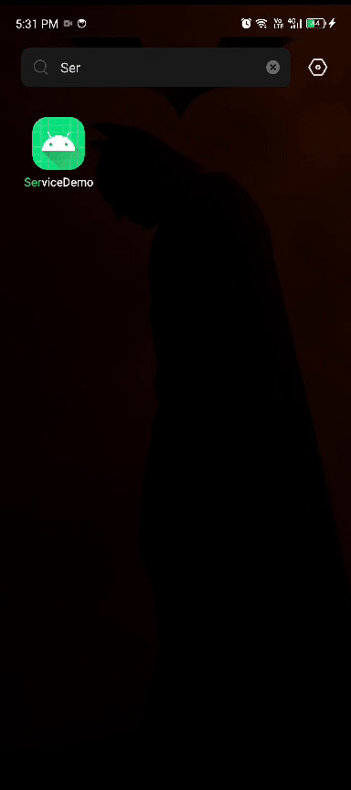

# Simple Counter Service (FGS) Demo

# Overview

This repository demonstrates a basic implementation of a foreground service (FGS) in Android, showcasing a simple counter functionality.

# Features

- A foreground service that runs continuously, displaying a counter value
- The counter increments every second
- The service can be started and resume from the app's main activity, and stopped from the notification and counter activity.

## License
Licensed under the [GNU General Public License v3.0](LICENSE)
